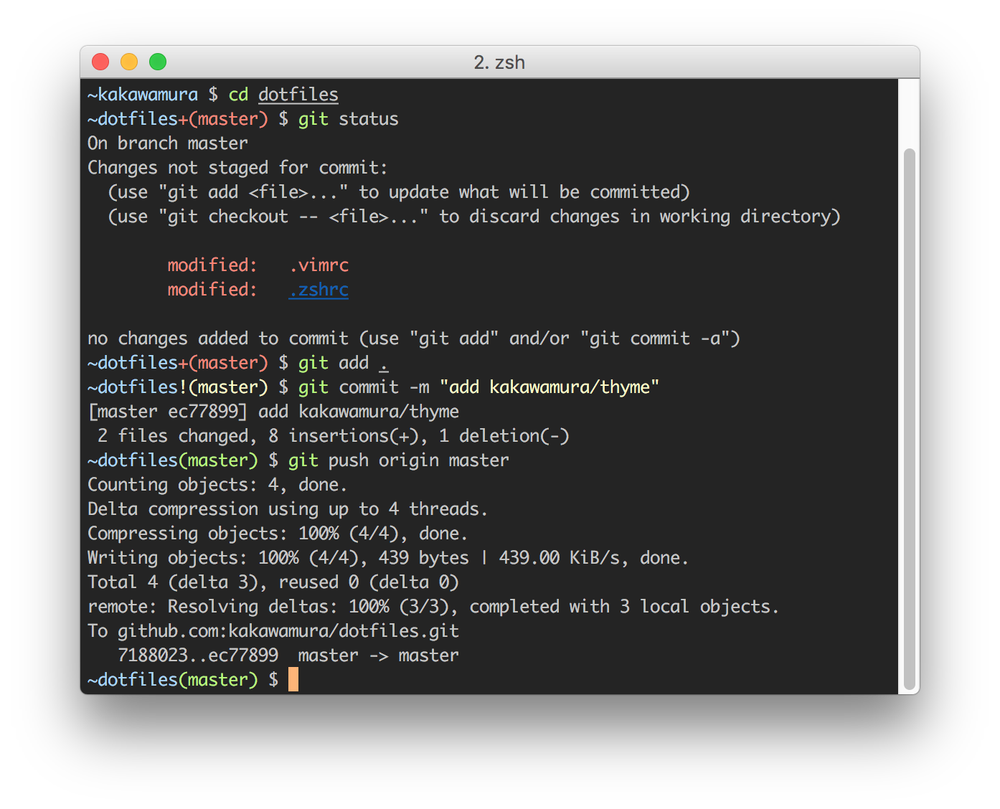

# Thyme

Simple standalone Zsh theme.



## Usage

### [Antigen](https://github.com/zsh-users/antigen)

``` zsh
antigen bundle kakawamura/thyme
```

### [zgen](https://github.com/tarjoilija/zgen)

``` zsh
zgen load kakawamura/thyme
```

### [zplug](https://github.com/b4b4r07/zplug)

``` zsh
zplug "kakawamura/thyme"
```

### [oh-my-zsh](https://github.com/robbyrussell/oh-my-zsh)

Clone this repository and make symbolic links to oh-my-zsh.

``` sh
git clone https://github.com/kakawamura/thyme.git
cd lime
ln -s "$PWD/thyme.plugin.zsh" ~/.oh-my-zsh/themes/thyme.zsh-theme
```

Then select the theme in `.zshrc`:

``` zsh
ZSH_THEME="thyme"
```

## License

Thyme is released under the MIT License.
